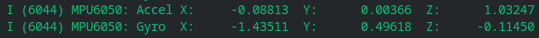

# ESP32 MPU6050 driver

A minimal driver for the MPU6050 gyroscope cum accelerometer using the ESP-IDF framework. It uses the [I2C protocol](https://en.wikipedia.org/wiki/I%C2%B2C) to communicate with the chip.

## Usage

Connect VCC to +3.3V, GND to ground, SCL to GPIO23, SDA to GPIO22 and ADD to GND(optional).
The pin configurations for SCL and SDA are set in `mpu6050.h`
The I2C clock speed is set to 100kHz by default but it can be changed in `i2c-driver.h`

## Note

This driver uses mode 0 for both the accelerometer and gyroscope (+=2g and +-250deg/s). Other modes can be used by referring to the [datasheet](https://invensense.tdk.com/wp-content/uploads/2015/02/MPU-6000-Register-Map1.pdf)
